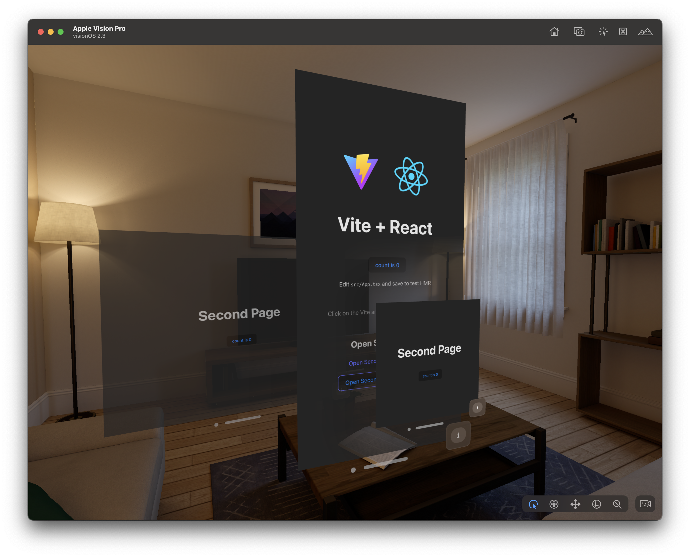
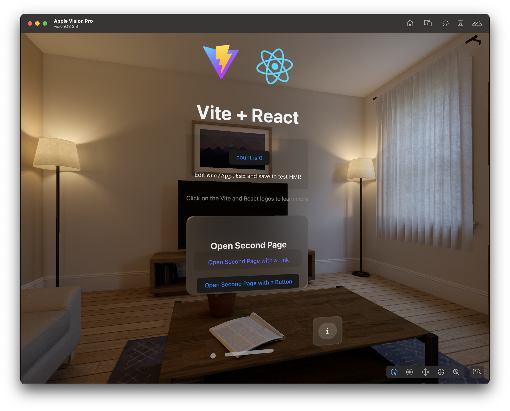
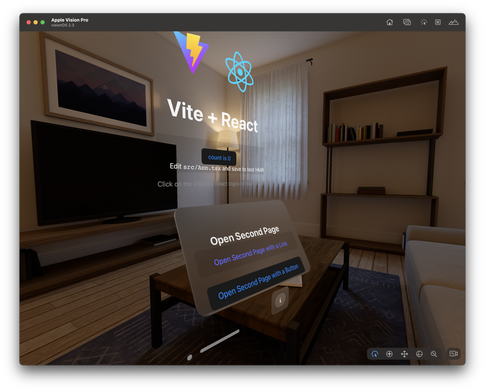

## About draft1

**draft1** is a first-draft spatial AI canvas application for Apple Vision Pro (visionOS). It combines [tldraw](https://tldraw.dev)'s infinite whiteboard with an AI agent backend — powered by Anthropic, OpenAI, and Google models via Cloudflare Workers and Durable Objects — and adds voice input through a Whisper speech-to-text server. The entire experience is delivered as a native spatial app using the [WebSpatial SDK](https://webspatial.dev), enabling multi-window layouts and immersive UI on visionOS.

**Key features:**
- 🖊️ Tldraw infinite canvas with AI agent integration
- 🤖 AI chat panel backed by Anthropic, OpenAI, and Google models
- 🎙️ Voice recording with Whisper speech-to-text transcription
- 🥽 Native visionOS spatial experience via the WebSpatial SDK
- ☁️ Cloudflare Workers + Durable Objects backend

---

<div align="center">
  

Make the Web Spatial Too

</div>

# Quick Example

> WebSpatial SDK + React + TypeScript + Vite

<div align="center" style="width: 100%; max-width: 1200px; display: flex; flex-wrap: wrap; justify-content: center; gap: 20px;">
  
  
  
</div>

## Tutorial

[A step-by-step tutorial to build this example from scratch](https://webspatial.dev/docs/quick-example)

## How to Use

### Setup

```bash
pnpm install:clean
```

### Preview on the visionOS Simulator

Step 1:

```bash
pnpm dev:avp
```

Step 2:

```bash
XR_DEV_SERVER="[URL from `pnpm dev:avp`]" pnpm run:avp
```

## WebSpatial Documentation

- [Table of Contents](https://webspatial.dev/docs)
- [Introduction](https://webspatial.dev/docs/introduction)
- [Core Concepts](https://webspatial.dev/docs/core-concepts)
- [Development Guide](https://webspatial.dev/docs/development-guide)
